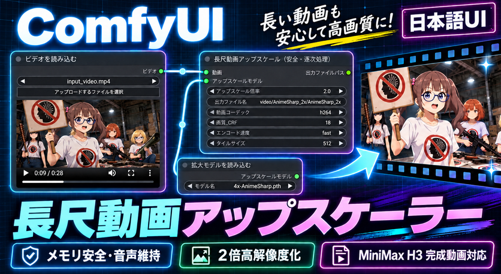

# ≪無料記事≫〖無料配布・ComfyUI〗長尺動画をメモリ安全に2倍高解像度化――AnimeSharp・音声維持・日本語UI



ComfyUIで、MiniMax H3などから完成した動画を**1フレームずつ安全に高解像度化するワークフロー**を公開しました。

通常の画像バッチ式アップスケールでは、動画が長くなるほどシステムRAMが急増する場合があります。今回の開発中には、28秒・672フレームの動画でPythonプロセスが約80GBまで増え、WSLが強制停止しました。

そこで、動画全体を画像バッチへ展開せず、フレームを1枚ずつAnimeSharpへ通して、その場でFFmpegへ書き込む専用ノードを作りました。同じ28秒動画を再検証した結果、最大ComfyUI RSSは2,312.4 MiBで完走しています。

## 無料公開先

GitHub：
https://github.com/FURUYAN1234/comfyui-long-video-upscaler

ワークフローJSONだけでなく、長尺安全処理を行う専用カスタムノード、導入手順、モデル情報、実測結果をまとめています。

## 2026年9月13日更新：完成動画を右ノード内で再生

**v1.0.1**では、処理完了後に右側の「③ 変換後動画をここで再生・保存」ノード内へ完成動画プレーヤーを表示するようにしました。左の①で入力動画、右の③で変換後動画を同じ画面上で確認でき、保存先も右ノード内に表示します。

0.5秒・12フレームのH.264／AAC動画を使った画面操作検証では、出力が1728×960、24fps、0.500秒になり、音声付きの完成動画を右ノード内で再生できることを確認しました。

Release：
https://github.com/FURUYAN1234/comfyui-long-video-upscaler/releases/latest

## このワークフローならではのメリット

### 1．長尺動画を全フレーム一括で保持しない

動画を読み込み、1フレームずつGPUで高解像度化し、順次FFmpegへ送ります。完成動画全体を巨大な画像テンソルとしてRAMへ保持しないため、動画尺に比例してメモリが膨れ続ける問題を抑えます。

### 2．元動画の音声を最後まで維持する

映像を高解像度化した後、元動画の音声ストリームをAACへ再エンコードして完成MP4へ入れます。

検証した28秒動画では、入力・出力とも音声は28.000秒でした。デコード音声の相関は0.999834、末尾2秒にも入力とほぼ同じ音量の音声データが残っていることを確認しました。

### 3．MiniMax H3の完成動画をそのまま後処理できる

これはH3生成ワークフローの途中へ挿入するものではありません。MiniMax H3、Wan、動画編集ソフトなどで**完成したMP4を入力する後処理用**です。

短尺で内容を確定してから高解像度化できるため、生成モデルを高い解像度で再実行する必要がありません。

### 4．日本語UIで必要な項目だけ変更できる

変更できる項目は次のとおりです。

- アップスケール倍率
- 出力ファイル名
- 動画コーデック
- 画質_CRF
- エンコード速度
- タイルサイズ

初回は2.0倍、H.264、CRF 18、fast、タイル512のまま試せます。

### 5．VRAM不足時にはタイル処理へ切り替える

通常は1フレーム全体を処理します。VRAM不足を検出した場合はタイル分割へ切り替え、512、256、128の順に小さいタイルで再試行します。

### 6．不完全な動画や危険な保存先を残しにくい

エンコード中は一時名で保存し、最後まで成功してから完成ファイル名へ変更します。失敗時の不完全ファイルは削除します。また、`ComfyUI/output`の外へ抜ける保存パスは拒否します。

## ワークフローの構成


右側の「③ 変換後動画をここで再生・保存」が、拡大変換・音声維持・MP4保存を行うLongVideoUpscaleSafeノードです。この画像は左の説明欄と右の実行領域を含む、入力動画を選択した実行前の全体見本です。右下が空欄でも、変換ノードが欠けているわけではありません。実行が正常完了すると、③の下部に変換後動画のプレーヤーと保存先が表示されます。②モデル選択ノードはこの画像では見えていません。実行前にモデル選択ノードで4x-AnimeSharp.pthを選択し、③のアップスケールモデル入力への接続を確認してください。

実処理ノードは3つです。

1. 完成動画を選択
2. 拡大モデルを読み込む
3. 長尺動画を安全にアップスケール

従来の「動画を画像へ分解」「全画像をバッチで拡大」「動画を作成」「動画を保存」を安全ノードへ統合しています。見た目のノード数を減らすことが目的ではなく、全フレーム保持を避けるための構成です。

左の入力ノードのプレイヤーは元動画の確認用です。完了後は右の処理ノード内に完成動画のプレイヤーと保存先が表示され、同じ動画が`ComfyUI/output/video/AnimeSharp_2x/`へ保存されます。

## 導入方法

### 1．専用カスタムノードを導入

ComfyUI ManagerのGit URLインストール機能へ、次を入力します。

```text
https://github.com/FURUYAN1234/comfyui-long-video-upscaler
```

または、`ComfyUI/custom_nodes/`で次を実行します。

```bash
git clone https://github.com/FURUYAN1234/comfyui-long-video-upscaler.git
```

### 2．Pythonライブラリを導入

ComfyUIが実際に使用しているPythonで`requirements.txt`を導入します。

WSL・Linuxのvenv例：

```bash
/path/to/ComfyUI/.venv/bin/python -m pip install -r "/path/to/ComfyUI/custom_nodes/comfyui-long-video-upscaler/requirements.txt"
```

Windows Portable版の例：

```powershell
.\python_embeded\python.exe -m pip install -r ".\ComfyUI\custom_nodes\comfyui-long-video-upscaler\requirements.txt"
```

FFmpegとffprobeも必要です。

```bash
ffmpeg -version
ffprobe -version
```

### 3．4x-AnimeSharpを取得

使用モデルはKim2091氏の`4x-AnimeSharp.pth`です。

作者モデルページ：
https://huggingface.co/Kim2091/AnimeSharp

配置先：

```text
ComfyUI/models/upscale_models/4x-AnimeSharp.pth
```

SHA-256：

```text
e7a7de2dafd7331c1992862bbbcd9e9712a9f9f8e6303f0aaa59b4341d359bab
```

モデルライセンスは**CC BY-NC-SA 4.0**です。作者表示、非営利、継承、変更表示などの条件があります。モデル本体はGitHubリポジトリへ同梱していません。利用前にライセンス本文を確認してください。

ワークフロー内のモデルローダーにも、ファイル名・配置先・取得URLを登録しています。対応するComfyUI／Managerでは不足モデルの取得候補として表示できます。

### 4．ワークフローを読み込む

リポジトリの次のファイルをComfyUIへドラッグします。

```text
workflows/AnimeSharp_LongVideo_Safe_2x_20260913211253.json
```

ワークフロー内にも、導入、設定、モデル、保存先、実測結果の説明欄を配置しています。

### 5．短い動画から実行

最初は3～5秒程度の動画で確認してください。

1. 完成動画を選択
2. `4x-AnimeSharp.pth`を選択
3. 倍率2.0、H.264、CRF 18、fast、タイル512を確認
4. 実行
5. 右側の③ノード内で完成MP4を最後まで映像・音声とも確認

短尺に成功してから長尺を処理すると、モデル・FFmpeg・保存先の問題を切り分けやすくなります。

## 実測結果

検証環境：

- Windows上のWSL2 Ubuntu
- NVIDIA GeForce RTX 5080・VRAM 16GB
- ComfyUI 0.35.0
- Frontend 1.51.10
- Python 3.10.6
- PyTorch 2.13.0+cu130

短尺検証：

- 入力：864×480、24fps、3.000秒、72フレーム
- 出力：1728×960、24fps、3.000秒、72フレーム
- 音声：AAC 32kHzステレオ
- 処理時間：64.861秒

長尺検証：

- 入力：864×480、24fps、28.000秒、672フレーム
- 出力：1728×960、24fps、28.000秒、672フレーム
- 音声：AAC 32kHzステレオ、28.000秒
- 処理時間：約563.5秒
- 最大ComfyUI RSS：2,312.4 MiB

各条件1回の実測であり平均値ではありません。GPU、入力解像度、動画尺、コーデック、モデルの読み込み状態によって変わります。

## SNS用動画の後処理として

縦型・横型を問わず、完成した短尺動画を投稿前に2倍化する用途に向いています。元動画の縦横比とfpsを維持しながら解像度を上げ、音声付きMP4として保存します。

ただし、アップスケールは元にない細部を完全に復元する処理ではありません。線や文字が強くなりすぎる場合は、別モデルを選ぶか、倍率と画質設定を調整してください。

## ライセンス

専用カスタムノードとワークフローはGPL-3.0です。AnimeSharpモデルはKim2091氏によるCC BY-NC-SA 4.0で、リポジトリには含まれません。

入力動画には、自分で使用・加工できる素材を使ってください。

## お問合せ

X：[@FURUYAN1234](https://x.com/FURUYAN1234)
GitHub：https://github.com/FURUYAN1234/comfyui-long-video-upscaler
