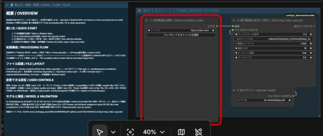

# ComfyUI Long Video AnimeSharp Upscaler / ComfyUI 長尺動画AnimeSharpアップスケーラー



[Read the release article on note / noteの公開記事を読む](https://note.com/happy_duck780/n/n0f190160e307)

A low-memory ComfyUI workflow and dedicated custom node for upscaling completed videos one frame at a time while keeping the original audio. It is suitable for finished MiniMax H3 videos and other standard video files.
/ 完成済み動画を1フレームずつ低メモリで高解像度化し、元の音声を維持するComfyUIワークフローと専用カスタムノードです。MiniMax H3の完成動画を含む一般的な動画ファイルへ使用できます。

> [!IMPORTANT]
> This is a **post-processing workflow**. Feed it a completed MP4 or another video supported by ComfyUI. It is not inserted into the MiniMax H3 generation graph by default.
> / これは**後処理用ワークフロー**です。MiniMax H3などで完成したMP4を入力します。通常はH3生成ワークフローの途中へ挿入しません。

## Why this workflow exists / このワークフローを作った理由

A conventional video-upscale graph may expand the entire video into one image batch. In the development case, a 28-second, 672-frame input drove the Python process to about 80 GB of resident memory and WSL was terminated by the out-of-memory killer.
/ 一般的な動画アップスケール構成では、動画全体を1つの画像バッチへ展開する場合があります。開発時の28秒・672フレーム入力ではPythonプロセスが約80GBまで増え、WSLがOOMで停止しました。

`LongVideoUpscaleSafe` decodes, upscales, and writes one frame at a time. The same 28-second video completed with a maximum measured ComfyUI RSS of 2,312.4 MiB. This is one measured result on the validation machine, not a guaranteed memory figure for every environment.
/ `LongVideoUpscaleSafe` は、デコード・拡大・書き込みを1フレームずつ行います。同じ28秒動画はComfyUIの最大実測RSS 2,312.4 MiBで完走しました。これは検証PCでの1回の実測であり、すべての環境で同じメモリ量を保証する値ではありません。

## Main benefits / 主な利点

- **Sequential frame processing:** avoids retaining the complete output video as a tensor batch. / **逐次フレーム処理：** 完成動画全体をテンソルバッチとして保持しません。
- **Audio preservation:** maps the source audio into the new MP4 and re-encodes it as AAC. / **音声維持：** 元動画の音声を新しいMP4へ割り当て、AACで再エンコードします。
- **Exact output scale:** choose 1.0x to 4.0x; the included workflow defaults to 2.0x. / **出力倍率指定：** 1.0～4.0倍を指定でき、同梱ワークフローは2.0倍が初期値です。
- **Japanese controls:** scale, file name, codec, CRF, preset, and tile size are labelled in Japanese. / **日本語設定：** 倍率、出力名、コーデック、CRF、速度、タイルサイズを日本語表示します。
- **Guidance on the canvas:** one consolidated English/Japanese guide card explains the run order, processing map, editable settings, installation layout, model license, output, and measured validation. / **キャンバス内ガイド：** 1枚に統合した英日説明欄に、実行順、処理構成図、設定、導入先のファイル構成図、モデルライセンス、保存先、実測結果を記載しています。
- **Result preview in place:** after processing, the finished video player and save location appear in the right-hand result node. / **完成動画をその場で確認：** 処理完了後、右側の結果ノード内に完成動画プレーヤーと保存先を表示します。
- **VRAM fallback:** if full-frame inference runs out of VRAM, tiled inference retries with progressively smaller tiles. / **VRAM不足時の分割処理：** 全画面推論でVRAM不足になった場合はタイルを段階的に縮小して再試行します。
- **Safe output handling:** rejects paths outside `ComfyUI/output`, writes to a partial file, and renames it after success. / **安全な出力処理：** `ComfyUI/output` 外へのパスを拒否し、一時ファイルへ書いた後、成功時に完成名へ変更します。
- **Local processing:** no cloud API, API key, or telemetry is used by this node. / **ローカル処理：** このノードはクラウドAPI、APIキー、テレメトリーを使用しません。

## Included files / 収録内容

```text
comfyui-long-video-upscaler/
├─ __init__.py
├─ workflows/
│  └─ AnimeSharp_LongVideo_Safe_2x_20260913211253.json
├─ assets/
│  ├─ workflow.png
│  └─ note-thumbnail.png
├─ README.md
├─ MODEL_LICENSE.md
├─ VALIDATION.md
├─ NOTE_ARTICLE.md
├─ SNS_POSTS.md
├─ requirements.txt
├─ pyproject.toml
└─ LICENSE
```

The repository does not include model weights, input videos, generated videos, API keys, personal dictionaries, or development-machine paths.
/ このリポジトリには、モデル本体、入力動画、生成動画、APIキー、個人用辞書、開発PC固有パスを収録していません。

## On-canvas documentation / ワークフロー内の説明欄

The workflow opens with one consolidated bilingual Markdown guide on the left and the three executable nodes on the right, all inside the saved viewport. The left video player is labelled as the input, while the right processing node shows the converted video and save location after completion. It uses ComfyUI's Markdown note, so the guide adds no custom-node dependency.
/ ワークフローは、左に1枚へ統合した英日Markdown説明欄、右に実行する3ノードを置き、すべてが保存済み表示範囲に入る配置です。左の動画プレーヤーは入力、右の処理ノードは完了後の変換済み動画と保存先であることを明記しています。ComfyUIのMarkdown説明欄を使うため、ガイド表示用のカスタムノード依存は増えません。

- Start here and run order. / 最初に読む手順と実行順。
- Per-frame processing and audio flow diagram. / 1フレーム逐次処理と音声結合の構成図。
- Editable settings with starting values. / 変更可能な設定と初期値。
- `ComfyUI/custom_nodes`, `models/upscale_models`, `input`, and `output` file-layout diagram. / 導入先・モデル・入力・出力のファイル構成図。
- Output behavior, license, and measured validation. / 保存動作、ライセンス、実測結果。

## Requirements / 必要環境

- A working [ComfyUI](https://github.com/Comfy-Org/ComfyUI) installation. / 動作する [ComfyUI](https://github.com/Comfy-Org/ComfyUI)。
- NVIDIA CUDA is recommended for practical speed. / 実用的な速度にはNVIDIA CUDAを推奨します。
- `ffmpeg` and `ffprobe` available on `PATH`. / `PATH`から実行できる`ffmpeg`と`ffprobe`。
- Python packages in `requirements.txt`, installed into ComfyUI's actual Python environment. / `requirements.txt`記載のPythonライブラリを、ComfyUIが実際に使うPythonへ導入します。
- `4x-AnimeSharp.pth` in `ComfyUI/models/upscale_models/`. / `ComfyUI/models/upscale_models/`へ配置した`4x-AnimeSharp.pth`。

## Installation / 導入方法

### Option A: ComfyUI Manager Git URL / ComfyUI ManagerのGit URL

Open ComfyUI Manager, choose the Git URL installation function, and enter:
/ ComfyUI ManagerでGit URLからのインストールを選び、次を入力します。

```text
https://github.com/FURUYAN1234/comfyui-long-video-upscaler
```

Restart ComfyUI completely after installation. The workflow embeds the repository identifier so compatible Manager versions can show this repository as the source of the missing custom node.
/ 導入後はComfyUIを完全に再起動してください。ワークフローにはリポジトリ識別情報が入っているため、対応するManagerでは不足カスタムノードの取得元としてこのリポジトリを表示できます。

### Option B: Git clone / Gitで直接導入

Run this inside `ComfyUI/custom_nodes/`.
/ `ComfyUI/custom_nodes/`で次を実行します。

```bash
git clone https://github.com/FURUYAN1234/comfyui-long-video-upscaler.git
```

Install the Python requirements with the interpreter used by ComfyUI.
/ ComfyUIが使用しているPythonへ依存ライブラリを導入します。

```bash
# Linux or WSL venv / Linux・WSLのvenv
/path/to/ComfyUI/.venv/bin/python -m pip install -r "/path/to/ComfyUI/custom_nodes/comfyui-long-video-upscaler/requirements.txt"

# Windows Portable / Windows Portable版
.\python_embeded\python.exe -m pip install -r ".\ComfyUI\custom_nodes\comfyui-long-video-upscaler\requirements.txt"
```

Check FFmpeg before starting ComfyUI.
/ ComfyUI起動前にFFmpegを確認します。

```bash
ffmpeg -version
ffprobe -version
```

## Download the upscale model / アップスケールモデルの取得

The workflow declares the exact model file, directory, and direct download URL in the `UpscaleModelLoader` metadata. Compatible ComfyUI or Manager versions can present it as a missing-model download candidate. If automatic placement is unavailable, download it manually.
/ ワークフローの`UpscaleModelLoader`には、正確なモデル名、配置先、直接ダウンロードURLを登録しています。対応するComfyUIまたはManagerでは、不足モデルの取得候補として表示できます。自動配置できない場合は手動で取得してください。

- File / ファイル：`4x-AnimeSharp.pth`
- Author / 作者：[Kim2091](https://huggingface.co/Kim2091)
- Download / 取得先：[Hugging Face](https://huggingface.co/Kim2091/AnimeSharp/resolve/main/4x-AnimeSharp.pth)
- Model page / モデル説明：[OpenModelDB](https://openmodeldb.info/models/4x-AnimeSharp)
- Destination / 配置先：`ComfyUI/models/upscale_models/4x-AnimeSharp.pth`
- SHA-256：`e7a7de2dafd7331c1992862bbbcd9e9712a9f9f8e6303f0aaa59b4341d359bab`
- Model license / モデルライセンス：[CC BY-NC-SA 4.0](https://creativecommons.org/licenses/by-nc-sa/4.0/)

AnimeSharp is not bundled in this repository. Its license requires attribution, non-commercial use, share-alike for adapted material, and indication of changes. Review the model license before use or redistribution.
/ AnimeSharp本体はこのリポジトリへ同梱していません。同モデルのライセンスには表示、非営利、改変物の継承、変更表示の条件があります。利用・再配布前に必ずモデルライセンスを確認してください。

## Load and run the workflow / ワークフローの読み込みと実行

1. Copy `workflows/AnimeSharp_LongVideo_Safe_2x_20260913211253.json` into any ComfyUI workflow folder, or drag it onto the ComfyUI canvas. / JSONを任意のComfyUIワークフローフォルダーへコピーするか、画面へドラッグします。
2. In `ビデオを読み込む`, upload or select the completed source video. / `ビデオを読み込む`で完成済み動画をアップロードまたは選択します。
3. Confirm that `4x-AnimeSharp.pth` is selected. / `4x-AnimeSharp.pth`が選択されていることを確認します。
4. Start with the defaults: 2.0x, H.264, CRF 18, `fast`, tile 512. / 初回は2.0倍、H.264、CRF 18、`fast`、タイル512の初期値で実行します。
5. Click Queue/Run. The finished MP4 is saved under `ComfyUI/output/video/AnimeSharp_2x/`. / 実行すると、完成MP4は`ComfyUI/output/video/AnimeSharp_2x/`へ保存されます。
6. After completion, play the result directly in node ③ on the right. The same node also shows the path below `ComfyUI/output`. / 完了後は右側の③ノード内で変換後動画を再生できます。同じノードに`ComfyUI/output`以下の保存先も表示されます。

## Editable settings / 変更できる設定

| Setting / 設定 | Meaning / 意味 | Recommended first value / 初回推奨 |
|---|---|---|
| `アップスケール倍率` | Output width and height multiplier. / 出力の縦横倍率。 | `2.0` |
| `出力ファイル名` | Relative path below `ComfyUI/output`. / `ComfyUI/output`以下の相対パス。 | `video/AnimeSharp_2x/AnimeSharp_2x` |
| `動画コーデック` | H.264 for compatibility; H.265 for smaller files where supported. / 互換性重視はH.264、対応環境で容量を抑えるならH.265。 | `h264` |
| `画質_CRF` | Lower values increase quality and file size. / 小さいほど高画質・大容量。 | `18` |
| `エンコード速度` | Slower presets improve compression efficiency. / 遅い設定ほど圧縮効率が向上。 | `fast` |
| `タイルサイズ` | VRAM fallback tile; lower it when tiled inference still runs out of memory. / VRAM不足時の分割サイズ。 | `512` |

## What the combined node does / 統合ノードの処理

The graph intentionally has three visible functional nodes: video input, upscale-model loader, and safe long-video processing. The safe node combines video decomposition, frame upscaling, video encoding, audio mapping, and final saving so that a full image batch is never retained.
/ グラフ上の実処理ノードは、動画入力、拡大モデル読み込み、安全な長尺処理の3つです。安全ノードが動画分解、フレーム拡大、動画エンコード、音声割り当て、最終保存を統合し、全画像バッチを保持しない構成にしています。

The player in node ① previews the input video. After a successful run, node ③ displays a separate player for the converted video, reports its path, and keeps the file under `ComfyUI/output/video/AnimeSharp_2x/`.
/ ①ノードのプレーヤーは入力動画の確認用です。正常完了後は③ノード内に変換後動画の別プレーヤーと保存先が表示され、ファイルは`ComfyUI/output/video/AnimeSharp_2x/`へ保存されます。

## Validation / 検証結果

See [VALIDATION.md](VALIDATION.md) for exact measurements and scope. The principal full-length test was 864×480, 24 fps, 28.000 seconds, 672 video frames, and AAC 32 kHz stereo. The result was 1728×960 with the same duration and frame counts. Processing took approximately 563.5 seconds on an RTX 5080 16 GB under WSL2.
/ 詳細は[VALIDATION.md](VALIDATION.md)を参照してください。主な長尺検証は864×480、24fps、28.000秒、672映像フレーム、AAC 32kHzステレオです。出力は1728×960で、時間とフレーム数を維持しました。WSL2・RTX 5080 16GB環境で約563.5秒でした。

## Troubleshooting / トラブル対処

- **Missing custom node:** install this repository under `ComfyUI/custom_nodes` and restart ComfyUI. / **カスタムノード不足：** このリポジトリを`custom_nodes`へ導入しComfyUIを再起動します。
- **Missing model:** place the exact file in `ComfyUI/models/upscale_models/` and refresh models or restart. / **モデル不足：** 正確なファイルを指定先へ置き、モデル一覧更新または再起動を行います。
- **`ffmpeg` not found:** install FFmpeg and add its executable directory to `PATH`. / **FFmpeg不足：** FFmpegを導入し、実行ファイルの場所を`PATH`へ追加します。
- **CUDA out of memory:** try tile 256 or 128; close other GPU applications. / **VRAM不足：** タイル256または128を試し、他のGPUアプリを閉じます。
- **System RAM grows with duration:** confirm that the graph uses `LongVideoUpscaleSafe`, not an image-batch video upscaler. / **動画が長いほどRAMが増え続ける：** 画像バッチ式ではなく`LongVideoUpscaleSafe`を使用しているか確認します。
- **No audio in the result:** first verify that the source file contains an audio stream with `ffprobe`. / **完成動画に音声がない：** `ffprobe`で元動画に音声ストリームがあるか確認します。

## Privacy / プライバシー

The node processes local files and does not transmit media or metadata. The public workflow contains only generic file names and relative output paths.
/ このノードはローカルファイルだけを処理し、動画やメタデータを外部送信しません。公開ワークフローには一般化したファイル名と相対出力先だけを収録しています。

## Licenses / ライセンス

The custom node and workflow in this repository are released under GPL-3.0. See [LICENSE](LICENSE). Third-party model weights are not included and retain their own license. See [MODEL_LICENSE.md](MODEL_LICENSE.md).
/ このリポジトリのカスタムノードとワークフローはGPL-3.0で公開します。[LICENSE](LICENSE)を参照してください。第三者モデルは同梱せず、個別のライセンスが適用されます。[MODEL_LICENSE.md](MODEL_LICENSE.md)を参照してください。

## Credits / クレジット

- [ComfyUI](https://github.com/Comfy-Org/ComfyUI) — GPL-3.0. / ComfyUI本体。
- [AnimeSharp by Kim2091](https://openmodeldb.info/models/4x-AnimeSharp) — CC BY-NC-SA 4.0 model dependency, not bundled. / 使用モデル。CC BY-NC-SA 4.0、非同梱。
- Workflow and custom-node integration by [FURUYAN1234](https://github.com/FURUYAN1234). / ワークフローと専用ノードの統合。
